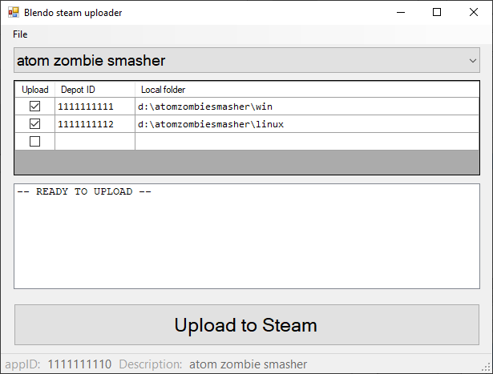

# Blendo steam uploader

## About
I wanted a more visual way of managing my builds, so I made a gui wrapper around Steam's command-line Steampipe tools.

This is written in C# and a .sln solution for Visual Studio 2010 is provided. Windows only.

## License
This source code is licensed under the zlib license. Read the license details here: [LICENSE.md](https://github.com/blendogames/steam_uploader/blob/master/license.md)

## Credits
by [Brendon Chung](http://blendogames.com)

## Libraries used
- [Json.NET](https://www.newtonsoft.com/json)